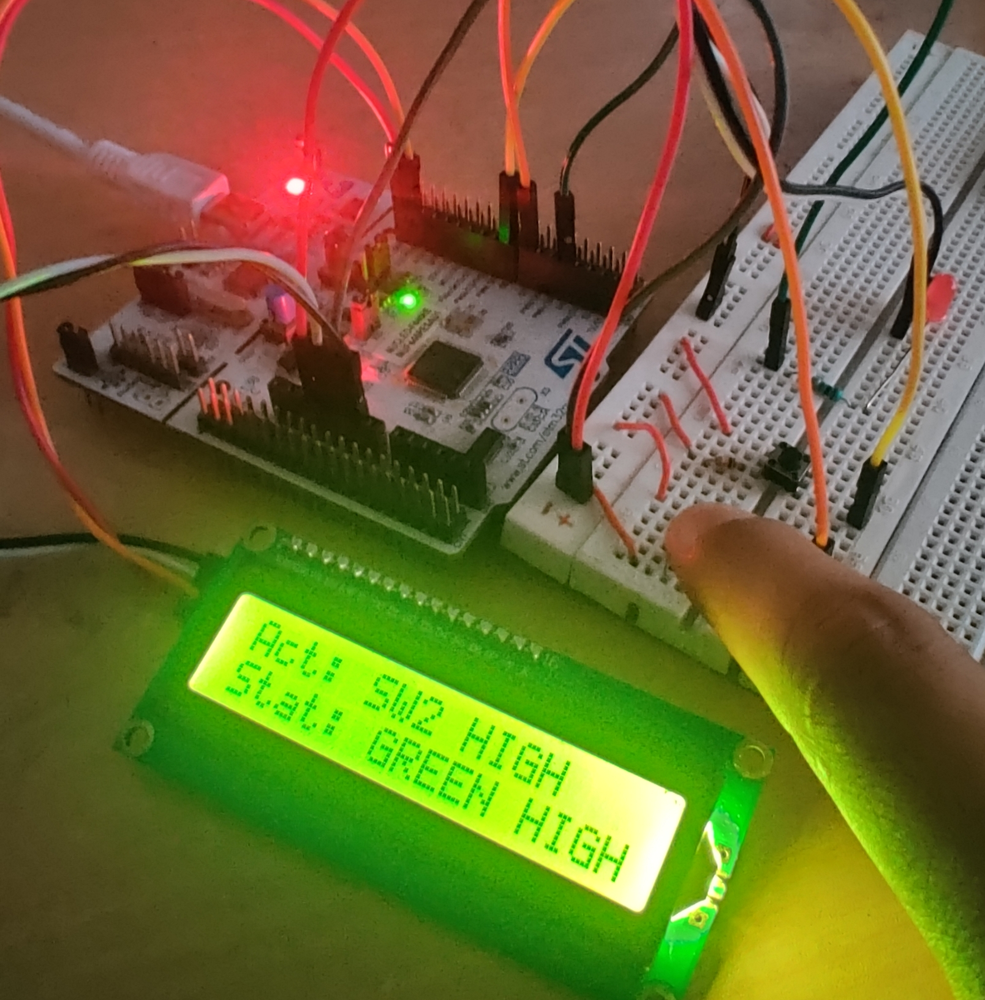
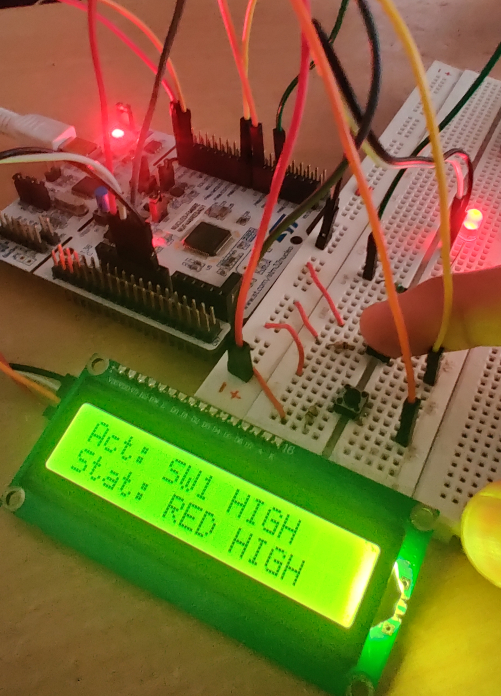
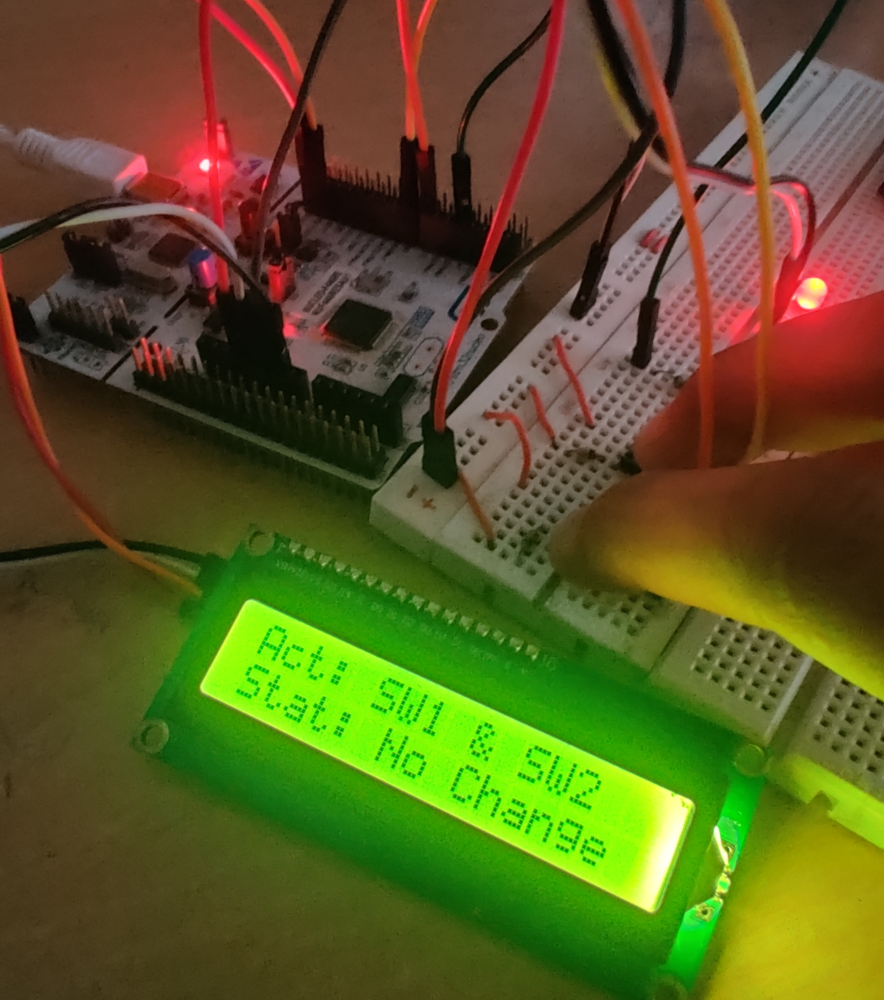
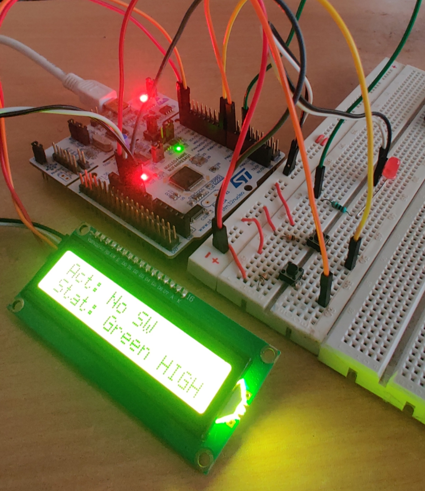
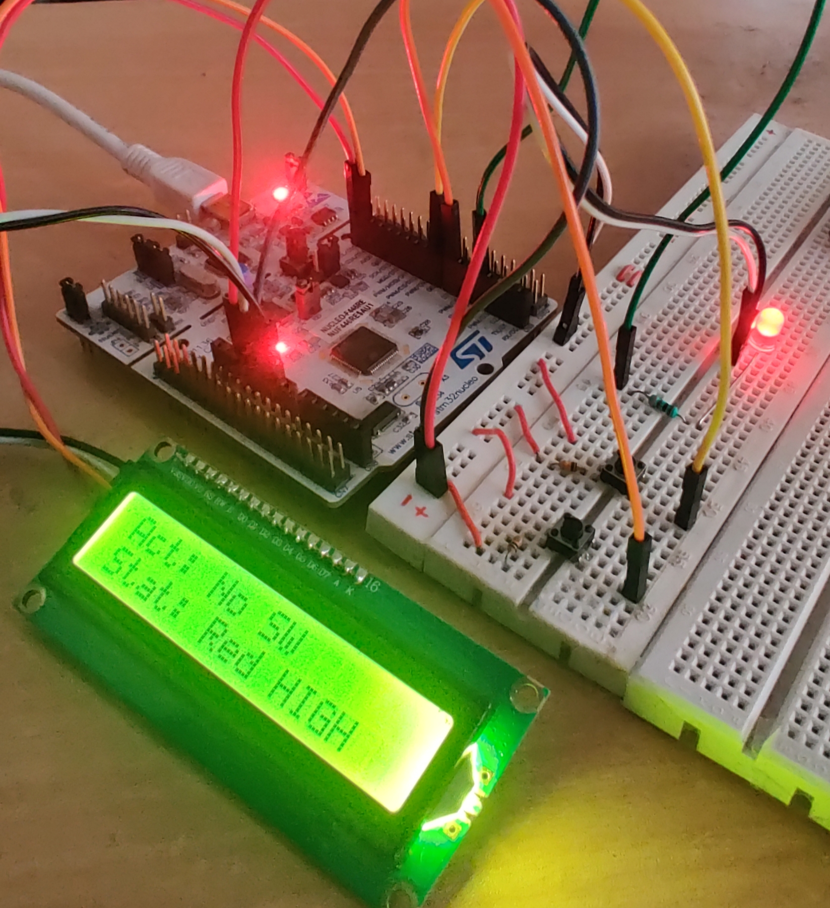

# Overview:

This system consists of three main FreeRTOS tasks: sw_press, led_control, and lcd_update. Together, these tasks manage the state of two switches and two LEDs, and display relevant information on an LCD.

# Goal:

1. Given 2 LEDs: Green and Red
2. A task that reads input from 2 Switch at 100ms.
3. When SW1 is pressed, red LED turns ON and when SW2 is pressed, green LED turns ON
4. If both Switch, SW1 and SW2 are pressed at the same time, no changes in the state of the LEDs.
5. If no switch is pressed, the led will start blinking one by one until any switch press is detected.
6. The LED status and the switch press will be update on the LCD at all times.

# Platform:

1. IDE: STM32CubeIDE
2. Development Board: NUCLEO-F446RE
3. Libraries: HAL
4. RTOS: FreeRTOS
5. Driver: 16x2 LCD (based on PCF8574 I2C Protocol)

# Documentation:

1. Refer here for the documentation of the FreeRTOS tasks: [tasks_explanation](/Docs/tasks_explanation.md)

# References:
1. [FreeRTOS](https://freertos.org/)
2. [PCF8574 I2C Expander](https://www.nxp.com/docs/en/data-sheet/PCF8574_PCF8574A.pdf)
3. [16x2 LCD Datasheet](https://www.sparkfun.com/datasheets/LCD/HD44780.pdf)
4. [STM32F446RE Datasheet](https://www.st.com/resource/en/datasheet/stm32f446re.pdf)
5. [NUCLEO - F446RE User Manual](https://www.st.com/resource/en/user_manual/um1724-stm32-nucleo64-boards-mb1136-stmicroelectronics.pdf)
6. [STM32F446RE Reference Manual](https://www.st.com/resource/en/reference_manual/rm0390-stm32f446xx-advanced-armbased-32bit-mcus-stmicroelectronics.pdf)
7. [NUCLEO - F446RE Schematic Diagram](https://www.st.com/resource/en/schematic_pack/mb1136-default-c03_schematic.pdf)
8. [SEGGER](https://www.segger.com/downloads/systemview/)

# Results:

## Video:
[Google drive link to the video](https://drive.google.com/file/d/1i_nlPog18NK3AtiKFvXKpyPOTRRp7A2Q/view?usp=share_link)

#### SW2 Pressed!

___

#### SW1 Pressed!

___

#### SW1 and SW2 Pressed!

___

#### SW1 and SW2 Pressed!

___

#### SW1 and SW2 Pressed!

___